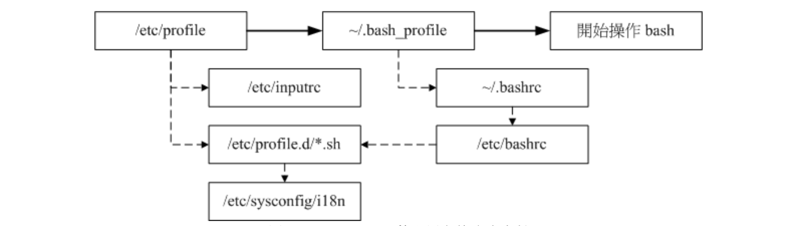

# Bash shell的操作环境
## **bash命令与命令搜寻顺序**
1. 以相对/绝对路径运行命令，例如` /bin/ls `或` ./ls `；
2. 由 alias 找到该命令来运行；
3. 由 bash 内建的 (builtin) 命令来运行；
4. 透过 $PATH 这个变量的顺序搜寻到的第一个命令来运行。

## **bash 的进站与欢迎信息： /etc/issue, /etc/motd**

## **bash的环境配置文件**
- ### login shell与non-login shell （重点在有没有登录,并且两种情况读取的配置文件不一样）
    - login shell：取得 bash 时需要完整的登陆流程的，就称为 login shell。
        - 举例来说，你要由 tty1 ~ tty6 登陆，需要输入用户的账号与密码，此时取得的 bash 就称为『 login shell 』啰；

    - non-login shell：取得 bash 接口的方法不需要重复登陆的举动，举例来说，
        - (1)你以 X window 登陆 Linux 后， 再以 X 的图形化接口启动终端机，此时那个终端接口并没有需要再次的输入账号与密码，那个 bash 的环境就称为 non-login shell了。
        - (2)你在原本的 bash 环境下再次下达 bash 这个命令，同样的也没有输入账号密码， 那第二个 bash (子程序) 也是 non-login shell 。
- ### login shell
    1. /etc/profile：这是系统整体的配置，你最好不要修改这个文件；
    2. ~/.bash_profile 或 ~/.bash_login 或 ~/.profile：属于使用者个人配置，你要改自己的数据，就写入这里！
### **/etc/profile (login shell 才会读，整体环境配置文件)**
这个配置文件可以利用使用者的标识符 (UID) 来决定很多重要的变量数据， 这也是每个使用者登陆取得 bash 时一定会读取的配置文件。这个文件主要配置的变量有：
1. PATH：会依据 UID 决定 PATH 变量要不要含有 sbin 的系统命令目录；
2. MAIL：依据账号配置好使用者的 mailbox 到 /var/spool/mail/账号名；
3. USER：根据用户的账号配置此一变量内容；
4. HOSTNAME：依据主机的 hostname 命令决定此一变量内容；
5. HISTSIZE：历史命令记录笔数。CentOS 5.x 配置为 1000 ；
`/etc/profile`还会呼叫外部的配置数据。
1. `/etc/inputrc`:使用者自定义输入的按键功能。
2. `/etc/profile.d/*.sh`:在 CentOS 5.x 中，这个目录底下的文件规范了 bash 操作接口的颜色、 语系、ll 与 ls 命令的命令别名、vi 的命令别名、which 的命令别名等等。如果你需要帮所有使用者配置一些共享的命令别名时， 可以在这个目录底下自行创建扩展名为 .sh 的文件，并将所需要的数据写入即可
3. `/etc/sysconfig/i18n`:决定 bash 默认使用何种语系。

### **~/.bash_profile (login shell 才会读，用户自定义配置文件)**
bash在读完了整体环境配置`/etc/profile`后，接下来则是读取使用者的个人配置文件。
所读取的个人配置文件主要有3个。依序分别是（最终只会读一个文件）：
1. ~/.bash_profile （1有，读1，下面2，3不会读）
2. ~/.bash_login  （1没有，读2，3不会读）
3. ~/.profile   （1，2没有，读3）


        loginshell登录，读取配置流程图

### **～/.bashrc (non-login shell会读，login shell最终也会读)**
non-loginshell的配置环境仅会读取 `～/.bashrc`文件

## **其它配置文件**
### /etc/man.config
规范了使用 man 的时候， man page 的路径到哪里去寻找！
### ~/.bash_history
记录历史命令，每次登陆 bash 后，bash 会先读取这个文件，将所有的历史命令读入内存。
### ~/.bash_logout
这个文件记录了，当我注销 bash 后，系统再帮我做完什么动作后才离开的信息。

## **终端机的环境配置（stty,set）**
### stty
查阅目前的一些按键内容可以利用 stty (setting tty 终端机的意思).
```bash
[root@www ~]# stty [-a]
选项与参数：
-a  ：将目前所有的 stty 参数列出来；

范例一：列出所有的按键与按键内容
[root@www ~]# stty -a
speed 38400 baud; rows 24; columns 80; line = 0;
intr = ^C; quit = ^\; erase = ^?; kill = ^U; eof = ^D; eol = <undef>; 
eol2 = <undef>; swtch = <undef>; start = ^Q; stop = ^S; susp = ^Z;
rprnt = ^R; werase = ^W; lnext = ^V; flush = ^O; min = 1; time = 0;
....(以下省略)....
```

### set
除了 stty 之外，其实我们的 bash 还有自己的一些终端机配置值呢！那就是利用 set 来配置。除了一些变量可以利用 set 来显示，除此之外，其实 set 还可以帮我们配置整个命令输出/输入的环境。 例如记录历史命令、显示错误内容等等。
```bash
[root@www ~]# set [-uvCHhmBx]
选项与参数：
-u  ：默认不激活。若激活后，当使用未配置变量时，会显示错误信息；
-v  ：默认不激活。若激活后，在信息被输出前，会先显示信息的原始内容；
-x  ：默认不激活。若激活后，在命令被运行前，会显示命令内容(前面有 ++ 符号)
-h  ：默认激活。与历史命令有关；
-H  ：默认激活。与历史命令有关；
-m  ：默认激活。与工作管理有关；
-B  ：默认激活。与刮号 [] 的作用有关；
-C  ：默认不激活。若使用 > 等，则若文件存在时，该文件不会被覆盖。

范例一：显示目前所有的 set 配置值
[root@www ~]# echo $-
himBH
# 那个 $- 变量内容就是 set 的所有配置啦！ bash 默认是 himBH 喔！

范例二：配置 "若使用未定义变量时，则显示错误信息" 
[root@www ~]# set -u
[root@www ~]# echo $vbirding
-bash: vbirding: unbound variable
# 默认情况下，未配置/未宣告 的变量都会是『空的』，不过，若配置 -u 参数，
# 那么当使用未配置的变量时，就会有问题啦！很多的 shell 都默认激活 -u 参数。
# 若要取消这个参数，输入 set +u 即可！

范例三：运行前，显示该命令内容。
[root@www ~]# set -x
[root@www ~]# echo $HOME
+ echo /root
/root
++ echo -ne '\033]0;root@www:~'
# 看见否？要输出的命令都会先被打印到屏幕上喔！前面会多出 + 的符号！
```
### bash 默认组合键
|组合按键|功能|
|-|-|
Ctrl + C	|终止目前的命令
Ctrl + D	|输入结束 (EOF)，例如邮件结束的时候；
Ctrl + M	|就是 Enter 啦！
Ctrl + S	|暂停屏幕的输出
Ctrl + Q	|恢复屏幕的输出
Ctrl + U	|在提示字符下，将整列命令删除
Ctrl + Z	|『暂停』目前的命令

## **通配符与特殊符号**
符号|意义
|-|-|
`*`	|代表『 0 个到无穷多个』任意字符
`?`	|代表『一定有一个』任意字符
`[ ]`	|同样代表『一定有一个在括号内』的字符(非任意字符)。例如 [abcd] 代表『一定有一个字符， 可能是 a, b, c, d 这四个任何一个』
`[-]`	|若有减号在中括号内时，代表『在编码顺序内的所有字符』。例如 [0-9] 代表 0 到 9 之间的所有数字，因为数字的语系编码是连续的！
`[^]`	|若中括号内的第一个字符为指数符号 (^) ，那表示『反向选择』，例如 `[^abc] `代表 一定有一个字符，只要是非 a, b, c 的其他字符就接受的意思。

例子：
```bash
[root@www ~]# LANG=C              <==由于与编码有关，先配置语系一下

范例一：找出 /etc/ 底下以 cron 为开头的档名
[root@www ~]# ll -d /etc/cron*    <==加上 -d 是为了仅显示目录而已

范例二：找出 /etc/ 底下文件名『刚好是五个字母』的文件名
[root@www ~]# ll -d /etc/?????    <==由于 ? 一定有一个，所以五个 ? 就对了

范例三：找出 /etc/ 底下文件名含有数字的文件名
[root@www ~]# ll -d /etc/*[0-9]*  <==记得中括号左右两边均需 *

范例四：找出 /etc/ 底下，档名开头非为小写字母的文件名：
[root@www ~]# ll -d /etc/[^a-z]*  <==注意中括号左边没有 *

范例五：将范例四找到的文件复制到 /tmp 中
[root@www ~]# cp -a /etc/[^a-z]* /tmp
```
## **通配符之外，bash 环境中的特殊符号**

|符号|	内容|
| -|-|
`#`|批注符号：这个最常被使用在 script 当中，视为说明！在后的数据均不运行
`\`	|跳脱符号：将『特殊字符或通配符』还原成一般字符
`|`	|管线 (pipe)：分隔两个管线命令的界定(后两节介绍)；
`;`	|连续命令下达分隔符：连续性命令的界定 (注意！与管线命令并不相同)
`~`	|用户的家目录
`$`	|取用变量前导符：亦即是变量之前需要加的变量取代值
`&`	|工作控制 (job control)：将命令变成背景下工作
`!`	|逻辑运算意义上的『非』 not 的意思！
`/`	|目录符号：路径分隔的符号
`>, >>`	|数据流重导向（标准输出)：输出导向，分别是『取代』与『累加』
`2>, >>2`|数据流重导向（标准错误输出)：输出导向，分别是『取代』与『累加』
`<, <<`	|数据流重导向：输入导向 (第二个是遇到...停止)
`' '`	|单引号，不具有变量置换的功能
`" "`	|具有变量置换的功能！
\`\`  | 两个\` \`反引号中间为可以先运行的命令，亦可使用 `$( )`
`( )`	|在中间为子 shell 的起始与结束
`{ }`	|在中间为命令区块的组合！
`$(( ))` | 用于数字运算

